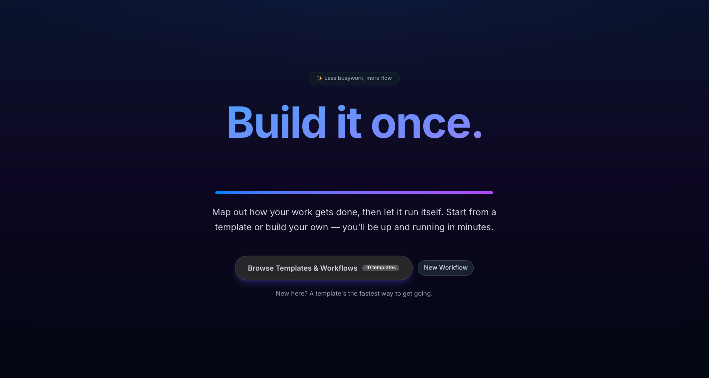

<h1 align="center">Fancy Workflows</h1>

<p align="center">
  <strong>Build it once. Run it forever.</strong><br>
  A visual, no-code workflow builder — map out how your work gets done, then watch it run.
</p>

<p align="center">
  
  
  
  
  
</p>

---



---

## About

**Fancy Workflows** is a visual builder for designing business processes and watching them run. Drag steps onto an infinite canvas, connect them into a flow, and run a live simulation that walks through each stage with a real-time run feed. Start from one of ten ready-made templates covering common real-world processes — onboarding, order processing, approvals and more — or build your own from scratch.

It's a **showcase application for [Fancy UI](https://ui.particle.academy) by Particle Academy**, built to demonstrate what a polished, production-feeling product looks like when assembled from the [`react-fancy`](https://ui.particle.academy) component library and the [`fancy-flow`](https://ui.particle.academy) node-based canvas. Every screen — the glassmorphism header, the gradient hero, the editor, the settings page — leans on these packages to stay cohesive and accessible across light and dark mode.

Under the hood it's a modern **Laravel + Inertia + React** single-page app: Laravel persists workflows and serves the pages, Inertia bridges the back end and front end without a separate API, and React (with Framer Motion) handles the interactive editor and animations. The result is a fast, fluid demo that feels like a real SaaS tool while remaining a clean, approachable codebase.

---

## Features

- 🗂️ **10 ready-made templates** — real-world business processes you can run or remix.
- 🎨 **Visual workflow editor** — drag-and-drop nodes and connections on an infinite canvas, powered by `fancy-flow`.
- ▶️ **Live run simulation** — execute a workflow and watch each step play out in a step-by-step run feed.
- 🕘 **Run history** — revisit past runs in a collapsible panel to see exactly what happened.
- 💾 **Save & load** — workflows are persisted to the database and reopened anytime.
- 📤 **Export & import** — download a workflow as JSON, or import one back in.
- 🗜️ **Bulk export** — bundle every saved workflow into a single ZIP from Settings.
- ↩️ **Undo / redo** — full edit history with keyboard support.
- ⚡ **Auto-save** — changes are saved as you work, with a live save-status indicator.
- 🌗 **Dark & light mode** — a theme that follows your system preference or your choice.
- ⌨️ **Keyboard shortcuts** — move fast with shortcuts for the actions you reach for most.
- 🎓 **Guided onboarding** — a step-by-step beginner guide gets newcomers building in minutes.
- 🤖 **Claude AI chat assistant** — a built-in assistant with 17 slash commands to build, edit and explain your workflows.
- 🧠 **Agentic nodes** — nodes that reason and act, powered by Prism PHP + Claude AI.
- 🔄 **BPMN 2.0 export** — export any workflow to the standard BPMN 2.0 XML format.
- 🩺 **Workflow health score** — run `/score` to grade a workflow and surface issues before you ship it.
- 💡 **Smart node suggestions** — context-aware next-step recommendations as you build.
- 📁 **Folders & pinning** — organize workflows into folders and pin the ones you reach for most.
- 📊 **Analytics dashboard** — visualize run metrics, with one-click PDF report export.
- ⏱️ **Node performance stats** — per-node execution timing surfaced in your run history.
- 🖼️ **Canvas themes** — switch the editor canvas between visual themes.
- ✨ **Auto-name workflows** — generate a fitting workflow name automatically.
- 📝 **Rich markdown rendering** — node descriptions render as styled prose via `ContentRenderer`.

---

## Tech Stack

| Package | Version | Role |
| --- | --- | --- |
| [Laravel](https://laravel.com) | `^13.8` | Back-end framework — routing, persistence, page rendering |
| [PHP](https://www.php.net) | `^8.3` | Server-side language |
| [Inertia.js (Laravel)](https://inertiajs.com) | `^3.1` | Server-side adapter bridging Laravel and React |
| [Prism PHP](https://prismphp.com) | `^0.100` | LLM toolkit powering the Claude AI assistant and agentic nodes |
| [fancy-seo](https://ui.particle.academy) | `*` | Particle Academy SEO meta-tag management (Laravel) |
| [Laravel Tinker](https://github.com/laravel/tinker) | `^3.0` | REPL for the application |
| [React](https://react.dev) | `^19.2` | Front-end UI library |
| [Inertia.js (React)](https://inertiajs.com) | `^3.3` | Client-side adapter — SPA navigation without an API |
| [react-fancy](https://ui.particle.academy) | `^4.4` | Particle Academy UI component library |
| [fancy-flow](https://ui.particle.academy) | `^0.5` | Particle Academy node-based workflow canvas |
| [fancy-echarts](https://ui.particle.academy) | `^4.0` | ECharts-powered charts for the analytics dashboard |
| [fancy-inertia](https://ui.particle.academy) | `^0.9` | Particle Academy Inertia.js integration helpers |
| [fancy-app-update](https://ui.particle.academy) | `^0.1` | In-app update notifications |
| [echarts](https://echarts.apache.org) | `^5.6` | Charting engine behind the analytics dashboard |
| [Framer Motion](https://www.framer.com/motion/) | `^12.40` | Animations and transitions |
| [Tailwind CSS](https://tailwindcss.com) | `^4.0` | Utility-first styling |
| [Lucide React](https://lucide.dev) | `^1.17` | Icon set |
| [canvas-confetti](https://github.com/catdad/canvas-confetti) | `^1.9` | Celebratory confetti effects |
| [Vite](https://vite.dev) | `^8.0` | Front-end build tool and dev server |

---

## Getting Started

### Prerequisites

- **PHP 8.3+** and **Composer**
- **Node.js 18+** and **npm**

### Installation

```bash
# 1. Clone the repository
git clone <your-repo-url> fancy-workflows
cd fancy-workflows

# 2. Install PHP dependencies
composer install

# 3. Create your environment file
cp .env.example .env

# 4. Generate the application key
php artisan key:generate

# 5. Run database migrations
php artisan migrate

# 6. Install JavaScript dependencies
npm install
```

### Running locally

The app needs the Vite dev server and the Laravel server running at the same time, in **two separate terminals**:

```bash
# Terminal 1 — front-end dev server (hot reload)
npm run dev
```

```bash
# Terminal 2 — Laravel application server
php artisan serve
```

Then open the URL printed by `php artisan serve` (by default <http://localhost:8000>).

### Front-end tests

React components are tested with **[Vitest](https://vitest.dev)** + **[Testing Library](https://testing-library.com)** (jsdom):

```bash
npm test         # run the suite once
npm run test:watch   # re-run on change
```

---

## Templates

Fancy Workflows ships with **10** ready-to-run templates covering common business processes:

| # | Template | Description |
| --- | --- | --- |
| 1 | **Employee Onboarding** | Automate the full onboarding process for new hires — accounts, tools, training and more. |
| 2 | **Order Processing** | Walk an order through the full fulfillment pipeline — payment, inventory, shipping and delivery. |
| 3 | **Bug Report** | Triage incoming bug reports, assign to the right developer, track fixes and close issues. |
| 4 | **Job Application Pipeline** | Screen applicants, run phone and technical interviews, then route strong candidates to an offer. |
| 5 | **Content Publishing** | Take a draft through editorial review and SEO checks, then schedule and publish it. |
| 6 | **Budget Approval** | Validate a spend request, run department review, then route it to manager or executive approval. |
| 7 | **PTO Request** | Check team coverage, get manager approval, update the calendar, and notify the team. |
| 8 | **Product Recall** | Assess a product issue, notify regulators if needed, alert customers, and process returns. |
| 9 | **Event Planning** | Book a venue, send invites, confirm arrangements once RSVPs clear, then run the day-of checklist and follow up. |
| 10 | **Return & Refund** | Verify a purchase, inspect the return, then process or deny the refund and close the case. |

---

## Built With Fancy UI

Fancy Workflows is a showcase for **[Fancy UI](https://ui.particle.academy) by [Particle Academy](https://ui.particle.academy)** — a design system for building beautiful, accessible React interfaces fast.

- **[`react-fancy`](https://ui.particle.academy)** — the component library powering every button, heading, badge, input and switch in the app.
- **[`fancy-flow`](https://ui.particle.academy)** — the node-based canvas that powers the visual workflow editor.
- **[`fancy-echarts`](https://ui.particle.academy)** — the charting components behind the analytics dashboard.
- **[`fancy-inertia`](https://ui.particle.academy)** — Inertia.js integration helpers for Fancy UI.
- **[`fancy-app-update`](https://ui.particle.academy)** — in-app update notifications.
- **[`fancy-seo`](https://ui.particle.academy)** — SEO meta-tag management on the Laravel side.

If you like what you see here, explore the full toolkit at **[ui.particle.academy](https://ui.particle.academy)**.

---

## Rich content rendering

Node descriptions are rendered as styled prose via [`react-fancy`'s `ContentRenderer`](https://ui.particle.academy/packages/react-fancy/content-renderer), wrapped in a single reusable component so the configuration lives in one place.

- **Where it's used** — `resources/js/Components/NodeConfigPanel.jsx`, the node detail panel on the editor. A read-only **Preview** of the selected node's description renders below the editable Description field. This is currently the only integration point.
- **The wrapper** — `resources/js/Components/WorkflowContentRenderer.jsx` is the single entry point. It centralises the renderer config, normalises legacy/empty values (`resources/js/lib/content.js`), and shows a muted fallback when there's no content.
- **Expected content format** — **Markdown** (`WORKFLOW_CONTENT_FORMAT` in `resources/js/lib/content.js`). Plain text is a valid subset of Markdown, so existing string descriptions render unchanged while authors can add `**bold**`, lists, links, and other Markdown going forward.
- **Sanitization** — rendering is **always sanitized**. `ContentRenderer` strips `<script>`/`<iframe>`/`<style>`/`<form>` and friends, removes `on*` event-handler attributes, and filters `href`/`src` to a safe-protocol allow-list (dropping `javascript:`, `data:`, etc.). The wrapper never forwards the `unsafe` prop, so there is no path to render raw, unsanitized HTML.

---

## License

Released under the [MIT License](https://opensource.org/licenses/MIT).
